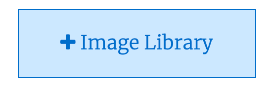
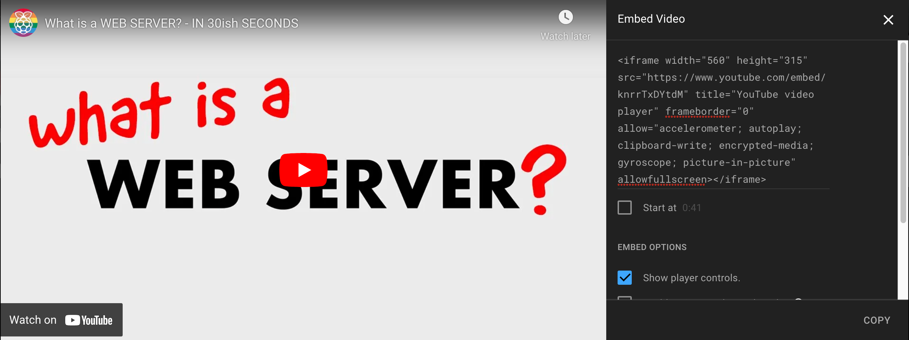

## Your grid

--- task ---

Create a class to make all the items in your grid the same size. You'll also need to make them `float` to the left, so they form a grid.

--- collapse ---
---
title: Making a grid of elements with CSS
---

To make a grid of HTML elements with CSS, you will need to set a common height and width for all the elements, and set them to float to the left. For a neat layout, the width of an element in the grid should divide evenly into the width of the container (usually a `div`) you are placing the elements into. For example, if the container `div` is 1200px wide, grid elements could be any of:

 + 600px
 + 400px
 + 300px

 Or even smaller, though things might start to get a little squashed!

```css
.my_grid_element{
    float: left;
    height: 400px;
    width: 400px;
}
```

--- /collapse ---

--- save --- 

--- /task ---

--- task ---

Add at least one image to your grid. You can find an image online, use one of the images included in the starter, or use one you already have. **Remember not to include photographs of yourself or your friends if you are going to publish the page online**.

[[[generic-get-picture-from-web]]]

[[[images-permissions-to-use]]]

--- collapse ---
---
title: Adding images to Trinket
---

To add an image to your Trinket project, first choose the Images section by selecting this icon.


Next, choose the "Image Library" button.



In the screen that opens, select "Upload New Image".


Then drag the images you want to upload into the box that appears.


--- /collapse ---

--- collapse ---
---
title: Including images in your webpage
---

The `img` tag is used to include pictures on a webpage. It has two attributes that must be set when doing so:

 + `src` — the source location of the image file, including the file name
 + `alt` — the alternative text description of the image, for users who rely on assistive tools, like screen readers, to browse your site

 ```html

 ```

--- /collapse ---

--- save --- 

**Test:** view `index.html` to see your image(s).

--- /task ---

--- task ---

Add at least one paragraph of text to your grid. This could be a quote, an interesting fact, some song lyrics, or any other text you might want to include.

**Choose:** You can also include headings in a `div` with your paragraph, using the `h1` to `h6` tags.

--- collapse ---
---
title: Including paragraphs of text in your webpage
---

The `p` tag is used to add paragraphs of text to your webpage.

```html
<p> 
    Whatever text you want to add to your webpage.
</p>

<p> 
    Another paragraph of text you want to include.
</p>
```

--- /collapse ---

--- collapse ---
---
title: Styling text with CSS
---

You can use the `font-family` property to make your text look different. The font families are:

  + <span style="font-family: cursive">cursive</span>
  + <span style="font-family: fantasy">fantasy</span>
  + <span style="font-family: monospace">monospace</span>
  + <span style="font-family: sans-serif">sans-serif</span>
  + <span style="font-family: serif">serif</span>

You can set font families like this:

```css
.my_class{
    font-family: cursive;
}
```

--- /collapse ---

--- collapse ---
---
title: Controlling text size
---

You can use the `font-size` property to make your text look bigger, or smaller. The default size, which the user chooses and on which the others are based, is `medium`. The font sizes are:

  + <span style="font-size: xx-small">xx-small</span>
  + <span style="font-size: x-small">x-small</span>
  + <span style="font-size: small">small</span>
  + <span style="font-size: medium">medium</span>
  + <span style="font-size: large">large</span>
  + <span style="font-size: x-large">x-large</span>
  + <span style="font-size: xx-large">xx-large</span>
  + <span style="font-size: xxx-large">xxx-large</span>

You can set font sizes like this:

```css
.my_class{
    font-size: large;
}
```

--- /collapse ---

--- save --- 

**Test:** view `index.html` to see your text.


--- /task ---

--- task ---

Use a second class to give your paragraph a background colour. Once more, there are tips on doing this below.

--- collapse ---
---
title: Using more than one class for the same element
---

Sometimes it makes sense to use more than one class for the same element. You just separate the names of the classes with a space. You can use as many classes as you like this way. If the rules in two classes conflict, the rule that appears later in the CSS file will win.

```html
<div class="grid_tile red"> 
    <!-- some text/images/etc. in here --> 
</div>
```

This is useful when, for example, several elements are the same size and shape but different colours.

--- /collapse ---

--- save --- 

**Test:** view `index.html` to see your new backgrounds.


--- /task ---

--- task ---

Include a video from YouTube in your grid. You can use [this video]((https://www.youtube.com/watch?v=knrrTxDYtdM)){:target="_blank"}, if you like.

--- collapse ---
---
title: Including YouTube video in your webpage
---

First, go to the video you want to include on YouTube and click the "share" button.


In the dialogue that opens you'll see a few ways you can share the video. Choose "Embed". Embedding means to include one thing inside another — this YouTube video will be embedded in your webpage.


In the dialogue that opens you'll see a few options you can use to modfiy the version of the video that will be shared on your webpage. Choose "Copy"



Paste the copied code into your webpage. This is an `iframe` tag. Remove its `width` and `height` attributes. Give it the same class you used on other elements to give them the `width`, `height`, and `float` properties that make them part of your grid. It should now be the right size and shape to fit neatly onto your page.
--- /collapse ---

--- save --- 

**Test:** view `index.html` to see your video.

--- /task ---

--- task ---

**Debug:** You might find some issues with your grid.

--- collapse ---
---
title: The container div doesn't appear
---

This is because the `float` property makes the `div`s in the grid behave a little differently, so they don't cause their container to grow. You can fix this by setting the `overflow` property on the container to `hidden`.

```css
.grid_container{
    background-color: green;
    margin-left: auto;
    margin-right: auto;
    overflow: hidden;
    width: 1200px;
}
```

--- /collapse ---

--- collapse ---
---
title: The divs in the grid start a new row without filling the current one completely
---
<html>
    <div style="width: 180px; height: 120px; background-color: seagreen; margin: 10px auto; overflow: hidden;">
        <div style="width: 63px; height: 60px; background-color: skyblue; float: left; border: 1px solid black;"> </div>
        <div style="width: 63px; height: 60px; background-color: yellow; float: left; border: 1px solid black;"> </div>
        <div style="width: 63px; height: 60px; background-color: red; float: left; border: 1px solid black;"> </div>
        <div style="width: 63px; height: 60px; background-color: violet; float: left; border: 1px solid black;"> </div>
    </div>
</html>

This is usually because the `width`s of the elements in the grid are too large. That means adding an extra element to a row would make that row wider than its container. Check your maths and change either the width of the container or the grid elements, if you need to.


If you've also added a border to any of the elements in the grid, you need to work that into your maths too. For example, if you have a two pixel border all the way around an element you need to subtract four pixels — two for each side — from the `width` and `height` of that element.

--- /collapse ---

--- /task ---

