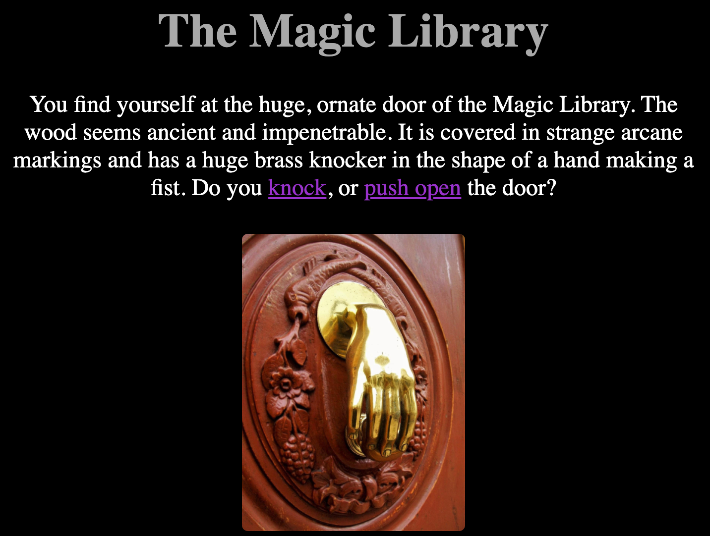

## What next?

If you are following the [OurPathwayNeedsAName](https://projects.raspberrypi.org/en/raspberrypi/pathway-name) pathway, you can move on to the [Choose Your Own Adventure Website](https://projects.raspberrypi.org/en/projects/cyoa-web) project. In this project, you will make a puzzle room out of linked web pages for people to explore.

--- print-only ---

--- /print-only ---

--- no-print ---

<iframe src="https://trinket.io/embed/html/4cfbe71ae4" width="100%" height="600" frameborder="0" marginwidth="0" marginheight="0" allowfullscreen=""></iframe>

--- /no-print ---

If you want to have more fun exploring web technology, then you could try out any of [these projects](https://projects.raspberrypi.org/en/projects?software%5B%5D=html-css-javascript)
